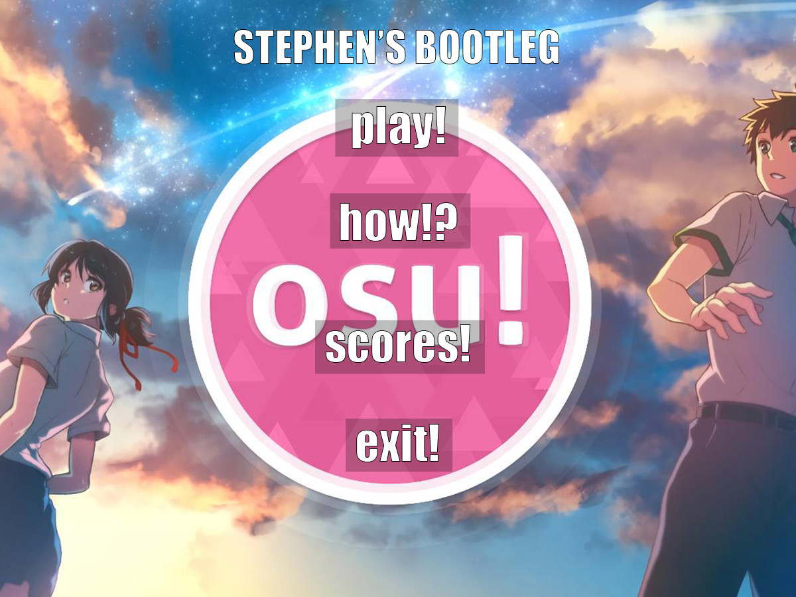

# Stephen's Bootleg osu!
Final project for ICS4U finished June 2019



This project contains a user manual, as well as code examples

# Requirements
Tested and compiled on 
- `Java JDK 10.0.2` with IntelliJ IDEA
- `openjdk 11`

Game resolution is locked to `1200 x 900`

# Build and Run
## Locally
To launch, run `src/Launcher.java` or in the shell:
```bash
java -jar BootlegOsu.jar
```
You can compile this yourself by running
```bash
make run-class
```
or
```bash
make run-jar
```
You can add `MUTE=1` to play the game muted

## Docker
**Only works in Linux with the X11 windowing system**

**Sound does not work unfortunately...**
```bash
make run-docker
```
You can force kill the running container by running
```bash
make docker-kill
```

# Issues
No volume control - Starting the game may be very loud

Unable to load `.wav` files on Sometimes...
